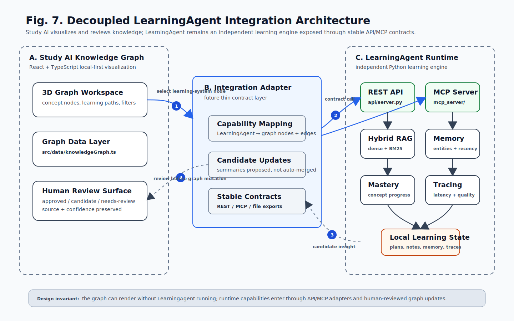

# Study AI Knowledge Graph

A local-first AI application knowledge graph for building a connected understanding of AI vendors, foundation models, agent technologies, enterprise use cases, and engineering practice.

## What This V1 Includes

- 3D rotatable, zoomable, draggable node-link graph.
- Search and category filters for companies, models, techniques, scenarios, and engineering topics.
- Learning paths for enterprise RAG, agent internship fundamentals, and model selection.
- Node detail panel with summary, tags, confidence, review status, sources, and relationship explanations.
- Typed local graph data designed for future agent-assisted updates.
- Project retrospective case studies extracted from BestCowork-GA and BestDEP-Lib git history.
- Decoupled LearningAgent integration map for the previous personalized learning agent project.

## LearningAgent Integration Architecture

`learningAgent/` is treated as an independent Python learning engine, not as code mixed into the React graph frontend. The graph records its capabilities and future integration contracts while keeping runtime coupling behind REST/MCP adapter boundaries.

<p align="center">
  
</p>

## LearningAgent Integration And Implementation Plan

This repository is `C:\Users\WU\Desktop\1\study_AI`. The existing learning-agent project is `C:\Users\WU\Desktop\1\learningAgent`.

The two projects should be combined by **service boundary**, not by copying Python code into the React frontend. Study AI becomes the product shell: knowledge graph, upload center, review queue, approved knowledge base, user-facing UI, and deployment entry. LearningAgent becomes a reusable learning engine: learning plans, learning sessions, RAG retrieval, memory, mastery tracking, summaries, MCP tools, traces, and evaluation.

### Responsibility Split

| Layer | Owned by Study AI | Reused from LearningAgent | Why this boundary matters |
| --- | --- | --- | --- |
| Frontend | 3D graph, filters, node detail, upload center, candidate review queue | None directly | The browser should not import or run Python internals. |
| Backend API | Auth, users, uploads, jobs, review workflow, graph writeback, OpenAPI contracts | Calls LearningAgent through REST/MCP/service adapters | Keeps future deployment and scaling controllable. |
| Document ingestion | Upload endpoint, object storage, job status, retry, audit trail | Chunking concepts from `core/rag/chunker.py`; AddKnowledge classification ideas from `processors/add_knowledge.py` | Study AI owns the uploaded files and review state. |
| RAG/vector store | Production storage adapter, tenant/user isolation, pgvector schema | Retrieval logic from `core/rag/retriever.py`; vector-store concept from `core/rag/vector_store.py` | Local Chroma is fine for demo, but shared production needs managed DB/storage. |
| Learning workflows | Displays learning insights as graph candidates | `agents/create_plan_agent.py`, `agents/vibe_learning_agent.py`, `agents/summary_agent.py`, `core/main_agent.py` | LearningAgent already has useful domain behavior. |
| Memory/mastery | Converts selected learning insights into candidate graph nodes | `core/memory_store.py`, `core/memory_retriever.py`, `core/mastery_tracker.py` | Reuse scoring ideas, but replace local JSONL persistence in server mode. |
| Agent interface | Product-level agent orchestration and review gate | `mcp_server/tools.py`, `mcp_server/resources.py`, `mcp_server/prompts.py` | MCP can expose LearningAgent tools without tight coupling. |
| Observability | Product logs, metrics, job traces, user audit events | `core/tracing.py`, `core/evaluation.py`, `core/rag/evaluator.py` | Agent systems need measurable quality, not opaque chat output. |

### Integration Shape

```text
Study AI React UI
  -> Study AI Backend API
     -> Upload and review modules
     -> Graph knowledge modules
     -> LearningAgent adapter
        -> LearningAgent REST API, MCP server, or internal service wrapper
           -> Learning plan / session / memory / mastery / RAG / evaluation modules
  -> PostgreSQL + pgvector
  -> Object storage
  -> Redis or queue service
  -> Worker pool for parsing, embedding, indexing, synthesis, and evaluation
```

The first version can run both projects locally on Windows:

```text
Terminal 1: cd C:\Users\WU\Desktop\1\study_AI && npm run dev
Terminal 2: cd C:\Users\WU\Desktop\1\learningAgent && python api/server.py
Terminal 3: cd C:\Users\WU\Desktop\1\study_AI\backend && uvicorn app.main:app --reload
```

The third command is the future Study AI backend that needs to be built. It should call LearningAgent through an adapter instead of letting React call LearningAgent directly.

### Data Flow For Uploaded AI Agent Materials

This is the core workflow you described: upload AI Agent technical material, parse it, classify it, and write it into your knowledge base.

```text
1. User uploads PDF, Markdown, TXT, code archive, URL, or notes in Study AI.
2. Study AI stores the raw file in object storage or local dev storage.
3. Study AI creates an ingestion job and returns job_id immediately.
4. Worker parses the document into normalized text and metadata.
5. Worker chunks the text with LearningAgent-style chunking rules.
6. Worker classifies content into AI Agent technology categories:
   RAG, memory, MCP, tool calling, planning, evaluation, vector DB, deployment,
   observability, multi-agent coordination, safety, cost/latency, and operations.
7. Worker embeds chunks and writes them to PostgreSQL + pgvector.
8. Worker asks the LearningAgent adapter for learning summary, weak-concept links,
   suggested learning path, and related concepts.
9. Study AI creates candidate knowledge nodes and candidate edges only.
10. You review, edit, approve, or reject candidates.
11. Only approved candidates enter the durable graph knowledge base.
```

The invariant is important: **LearningAgent can propose knowledge, but it must not directly mutate approved Study AI graph data.**

### Memory And Vector Store Implementation Path

The concrete memory and vector-store path should borrow the strongest design ideas from `C:\Users\WU\Desktop\1\BestCowork-GA`, but not copy its desktop storage stack as the Study AI production backend.

BestCowork-GA currently proves a strong local knowledge-base pattern:

- `src/main/libs/localKnowledgeBase/schema.ts` uses `better-sqlite3 + sqlite-vec + FTS5`.
- `src/main/libs/localKnowledgeBase/chunker.ts` keeps chunking simple, overlap-aware, and position-aware.
- `src/main/libs/localKnowledgeBase/indexer.ts` writes chunks and embeddings progressively instead of holding all embeddings in memory.
- `src/main/libs/localKnowledgeBase/search.ts` combines FTS/BM25-style keyword recall, dense vector search, sparse lexical search, RRF fusion, and reranking.
- `src/main/libs/localKnowledgeBase/service.ts` supports async document processing, job-like document status, multi-knowledge-base search, precomputed query embeddings, and unified reranking.
- `src/main/libs/coworkMemoryExtractor.ts`, `src/main/libs/coworkMemoryJudge.ts`, and `src/main/libs/memorySync.ts` show useful memory gates: explicit add/delete extraction, durable-memory judgment, guard levels, L1 memory indexing, and database sync.

The difference is deployment shape:

| Decision area | BestCowork-GA local design | Study AI backend target |
| --- | --- | --- |
| Runtime | Electron main process | FastAPI service |
| Primary database | SQLite per local knowledge base | PostgreSQL shared service database |
| Vector extension | sqlite-vec | pgvector |
| Full-text search | SQLite FTS5 | PostgreSQL full-text search or trigram indexes |
| File storage | Local app/user data | Local dev storage first, Alibaba Cloud OSS later |
| Background work | Async local process work | Worker queue with retry, timeout, and job status |
| Memory persistence | Local files plus SQLite sync | PostgreSQL memory tables plus optional export files |
| Production scaling | Best for local personal use | Designed for multi-user web service and cloud deployment |

Recommended Study AI implementation:

```text
Study AI Backend
  -> Document service
     -> documents
     -> document_chunks
     -> document_assets
  -> Retrieval service
     -> PostgreSQL full-text recall
     -> pgvector dense recall
     -> optional sparse lexical recall
     -> RRF fusion
     -> optional reranker
  -> Memory service
     -> memory_events
     -> agent_memories
     -> memory_index
     -> memory_judgments
  -> Candidate service
     -> knowledge_candidates
     -> candidate_edges
     -> evidence_records
  -> Learning service
     -> LearningAgent adapter
```

The first database schema should be relational and pgvector-native:

```text
documents
  id, owner_id, title, source_type, storage_uri, mime_type, file_size,
  content_hash, status, created_at, updated_at

document_chunks
  id, document_id, seq, start_pos, end_pos, content, token_count,
  category, tags, created_at

chunk_embeddings
  chunk_id, embedding vector, embedding_model, embedding_dim, created_at

retrieval_sparse_terms
  chunk_id, term, weight

agent_memories
  id, owner_id, scope, memory_type, content, entities, importance,
  confidence, source_id, status, created_at, updated_at

memory_events
  id, memory_id, action, reason, actor, source_text, created_at

memory_index
  id, owner_id, layer, category, name, description, memory_ref,
  updated_at

knowledge_candidates
  id, candidate_type, title, summary, confidence, review_status,
  source_document_id, source_memory_id, created_at, updated_at

candidate_edges
  id, candidate_id, source_node, target_node, label, explanation

evidence_records
  id, candidate_id, source_type, source_id, quote, location, created_at

ingestion_jobs
  id, owner_id, document_id, status, stage, error, retry_count,
  started_at, finished_at, created_at
```

Phase A should stay cheap and practical:

1. Use PostgreSQL locally with pgvector enabled.
2. Store uploaded files on local disk through a storage adapter.
3. Use an in-process or lightweight Redis-backed queue for ingestion jobs.
4. Implement dense vector search plus PostgreSQL full-text search first.
5. Add RRF fusion early because it is simple and improves mixed retrieval quality.
6. Keep sparse lexical search and reranker behind interfaces; add them after basic retrieval works.
7. Implement memory extraction and judgment rules based on BestCowork-GA's guard concept, but store accepted memories in PostgreSQL.
8. Let LearningAgent provide learning summaries and weak concepts through the backend adapter.

Phase B can move the same adapters to Alibaba Cloud:

1. Local file storage -> Alibaba Cloud OSS.
2. Local PostgreSQL -> Alibaba Cloud RDS PostgreSQL with pgvector support where available, or ECS-hosted PostgreSQL if managed pgvector is not available.
3. In-process queue -> Redis/RQ/Celery or Alibaba Cloud queue service.
4. Local logs -> structured logs, metrics, tracing, and alerting.
5. Local-only auth -> production auth, rate limits, tenant/user isolation, backup, and disaster recovery.

The practical rule: **reuse BestCowork-GA's retrieval and memory design, but implement Study AI storage as service-grade PostgreSQL/pgvector from the start.**

### Minimum Backend Contracts To Build

Study AI backend should expose product contracts:

```http
POST /v1/uploads
GET  /v1/uploads/{upload_id}
POST /v1/ingestion-jobs
GET  /v1/jobs/{job_id}
GET  /v1/knowledge/candidates
POST /v1/knowledge/candidates/{candidate_id}/approve
POST /v1/knowledge/candidates/{candidate_id}/reject
GET  /v1/graph
POST /v1/retrieval/search
POST /v1/learning/plans
POST /v1/learning/sessions
GET  /v1/learning/domains/{domain}/summary
GET  /v1/learning/domains/{domain}/weak-concepts
```

The LearningAgent adapter should hide which integration mode is currently used:

```text
Local dev mode: Study AI backend -> http://127.0.0.1:8000/api/... LearningAgent API
MCP mode:       Study AI backend -> LearningAgent MCP tools
Service mode:   Study AI backend -> deployed LearningAgent service
Library mode:   Study AI backend -> narrow wrapper around selected LearningAgent modules
```

For production, service mode is safest. For early development, local dev mode is cheapest and fastest.

### A Then B Deployment Strategy

You do not need to pay for Alibaba Cloud from day one.

| Phase | Where it runs | Cost posture | Goal | Exit condition |
| --- | --- | --- | --- | --- |
| A0 local | Windows local machine | Free except API/model usage | Prove UI, upload flow, candidate review, and LearningAgent adapter | Local backend can ingest a document and generate reviewable candidates. |
| A1 cheap dev | Local DB or small self-hosted VPS | Low | Add PostgreSQL + pgvector, queue, and worker jobs | Same workflow works without local-only files. |
| A2 staging | Alibaba Cloud small ECS + managed PostgreSQL or self-managed Postgres | Starts paid, keep small | Test deployment, domain, HTTPS, backups, basic monitoring | Can survive realistic personal usage and demos. |
| B production | Alibaba Cloud ECS/ACK + RDS PostgreSQL + OSS + Redis + observability | Paid monthly | High concurrency, reliability, backup, scaling, access control | p95 latency, queue lag, error rate, and cost are measurable. |

This means the practical path is **A first, B later**. Build the code so the storage and adapter layers can move from local to cloud without rewriting product logic.

### Implementation Roadmap

1. **Backend foundation**
   - Create `study_AI/backend`.
   - Add FastAPI app, OpenAPI schemas, health endpoint, config, logging, and tests.
   - Define ports for storage, vector repository, queue, LearningAgent adapter, and graph repository.

2. **LearningAgent adapter**
   - Add a local REST adapter that calls `learningAgent/api/server.py` endpoints.
   - Add adapter tests with mocked responses.
   - Fix or work around the current LearningAgent API syntax blocker before relying on the chat endpoint.

3. **Upload and ingestion**
   - Add upload endpoint and local dev file storage.
   - Add parser interfaces for Markdown/TXT/PDF first.
   - Create ingestion jobs so slow parsing and embedding do not block HTTP requests.

4. **RAG and vector storage**
   - Start with PostgreSQL + pgvector as the target schema.
   - Store chunks with `document_id`, `source`, `tags`, `category`, `embedding`, and evidence offsets.
   - Keep dense retrieval plus keyword/BM25-style retrieval as the target.

5. **Candidate knowledge pipeline**
   - Convert parsed material plus LearningAgent summaries into candidate nodes and edges.
   - Store candidate status: `candidate`, `approved`, `rejected`, `needs-review`.
   - Require evidence, source, confidence, and category before approval.

6. **Review queue UI**
   - Add a frontend surface for uploaded documents, job status, and candidate review.
   - Approval writes into graph data through the backend, not directly in React static data.

7. **Production hardening**
   - Add auth, rate limiting, request IDs, structured logs, queue retries, idempotency keys, metrics, backups, and migration scripts.
   - Load test ingestion and retrieval separately.
   - Add deployment docs for Alibaba Cloud ECS/RDS/OSS/Redis.

### Immediate Discussion Points

Before implementation, these choices affect cost and architecture:

| Decision | Recommended default | Why |
| --- | --- | --- |
| Start local or cloud | Local first | Avoid early cloud cost while contracts are still moving. |
| Vector DB | PostgreSQL + pgvector | One database can handle users, graph, candidates, chunks, and vectors at the beginning. |
| LearningAgent coupling | Backend adapter | Lets us reuse existing work while keeping Study AI deployable. |
| Upload storage | Local in dev, OSS in cloud | Same storage interface, different adapter. |
| Queue | In-process/dev queue first, Redis/RQ/Celery later | Keeps phase A cheap while preserving production shape. |
| Graph DB | Not yet | The current graph can live in relational tables until graph queries become complex. |
| Human review | Required | Prevents noisy agent output from polluting your personal knowledge base. |

Production planning docs and diagrams:

- [LearningAgent production reuse plan](docs/architecture/learning-agent-production-reuse.md)
- [Production target architecture](docs/images/fig8-learningagent-production-architecture.svg)
- [High-concurrency ingestion flow](docs/images/fig9-high-concurrency-learning-flow.svg)
- [Module boundary map](docs/images/fig10-learningagent-module-boundaries.svg)

## Run Locally

```bash
npm install
npm run dev
```

Open the local URL printed by Vite.

Backend Phase A foundation:

```bash
cd backend
python -m venv .venv
.venv\Scripts\activate
pip install -r requirements.txt
uvicorn app.main:app --reload --port 8001
```

Open `http://127.0.0.1:8001/health`.

## Verify

```bash
npm test -- --run
npm run build
cd backend
python -m compileall -q app tests
python -m unittest discover -s tests
```

## Project Structure

```text
src/data/knowledgeGraph.ts   Seed AI knowledge graph nodes, edges, and learning paths
src/lib/graph.ts             Pure graph helper functions
src/components/              Sidebar, 3D graph, and detail panel
src/styles/global.css        App styling
tests/graph.test.ts          Core graph behavior tests
docs/superpowers/            Design and implementation plan
backend/                     FastAPI backend foundation for uploads, retrieval, memory, and adapters
learningAgent/               Independent Python learning engine: RAG, memory, MCP, API
integrations/                Reserved adapter boundary for future runtime coupling
```

## Future Agent Update Flow

The current data model already includes `source`, `confidence`, `reviewStatus`, and `updatedAt`.

A future agent workflow can:

1. Search trusted sources for new AI model, vendor, technique, and engineering updates.
2. Generate candidate nodes and relationships.
3. Mark them as `candidate` or `needs-review`.
4. Show the proposed change in an approval queue.
5. Write approved updates back into the graph data.

Human review remains the gate before the knowledge graph changes.

## Project Retrospectives

The graph includes a `case-study` layer for real engineering lessons. Current examples come from:

- `BestCowork-GA`: Skill Builder state bugs, skill lifecycle cleanup, group chat room isolation, agent memory, LAN DEP discovery.
- `BestDEP-Lib`: startup health-check hangs, high-concurrency CPU pressure, clean-deploy seed databases, Wiki soft-delete recreation, skill permission alignment.
