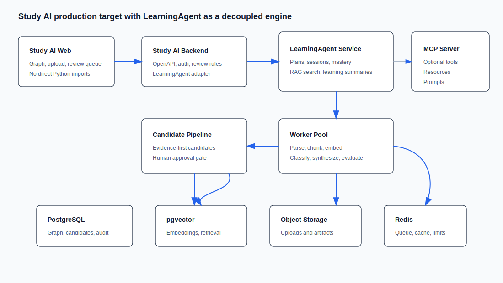
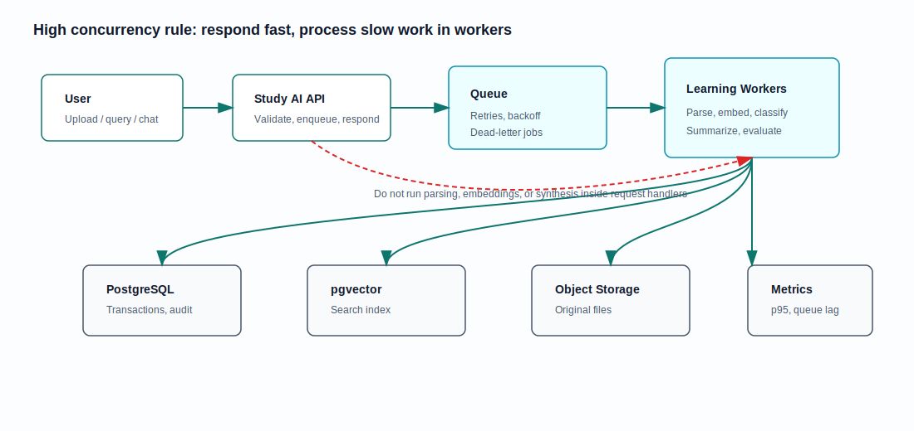
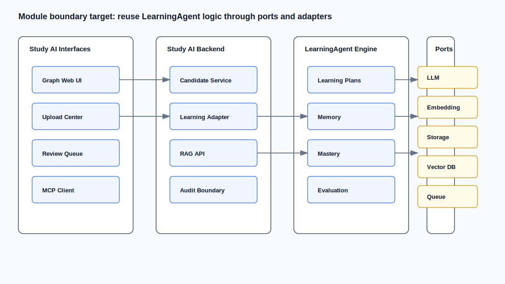

# LearningAgent Production Reuse Plan

## Purpose

This document records how Study AI should reuse the existing sibling project `../learningAgent` without turning the React graph app into a mixed frontend/Python runtime. The goal is a deployable, high-concurrency, modular Study AI system where LearningAgent contributes learning-domain intelligence through stable service boundaries.

## Reuse Verdict

LearningAgent can be reused, but as a **domain engine**, not as a direct frontend dependency and not as an as-is production service.

| Area | Reuse rating | Evidence from `../learningAgent` | Study AI action |
| --- | --- | --- | --- |
| Learning workflows | High | `agents/create_plan_agent.py`, `agents/vibe_learning_agent.py`, `agents/summary_agent.py`, `core/main_agent.py` | Wrap as backend learning services. |
| RAG primitives | Medium-high | `core/rag/chunker.py`, `core/rag/vector_store.py`, `core/rag/retriever.py`, `core/rag/evaluator.py` | Reuse concepts; move vector persistence behind Study AI storage adapters. |
| Memory and mastery | Medium-high | `core/memory_store.py`, `core/memory_retriever.py`, `core/mastery_tracker.py` | Keep schemas/scoring ideas; replace JSONL/file persistence for server mode. |
| MCP exposure | Medium | `mcp_server/tools.py`, `mcp_server/resources.py`, `mcp_server/prompts.py` | Keep as optional service interface. |
| REST API | Medium | `api/server.py` | Useful prototype; needs production hardening. |
| High concurrency readiness | Low today | Local files, Chroma persistence, global API singletons, no queue/auth/rate limits | Refactor before cloud deployment. |

## Current Blockers To Fix Before Production

- `../learningAgent/api/server.py` currently fails `python -m compileall -q .` because the chat response f-string contains nested escaping that Python rejects.
- `../learningAgent/core/rag/__init__.py` imports `Embedder`, which eagerly loads `sentence_transformers`; lightweight imports can fail if the local NumPy/sklearn stack is incompatible.
- Persistence is local-first: Markdown files, JSONL memory, JSON traces, and local ChromaDB are not appropriate as shared high-concurrency stores.
- API runtime is prototype-shaped: permissive CORS, no auth, no rate limiting, no queue, and global singleton service instances.

## Target Architecture



Study AI should own:

- graph visualization
- upload/review UI
- AI Agent technology taxonomy
- approved/candidate knowledge separation
- audit trail and human review invariant

LearningAgent should own:

- personalized learning plans
- adaptive learning sessions
- quiz and mastery tracking
- learning memory retrieval
- learning summaries
- optional MCP learning tools

## High-Concurrency Flow



Slow operations should not run in request handlers:

- document parsing
- embedding generation
- RAG indexing
- summary generation
- evaluation
- Study AI candidate synthesis

These should run in worker jobs with retry, timeout, idempotency, and job status endpoints.

## Module Boundaries



Refactor toward ports/adapters:

```text
learning_agent/
  domain/          pure learning, memory, mastery, RAG, evaluation concepts
  application/     create-plan, learning-session, ingestion, Study AI adapter services
  ports/           LLM, embedding, memory repository, vector repository, storage, queue
  adapters/        HelloAgents, sentence-transformers, PostgreSQL, pgvector, OSS/local storage
  interfaces/      REST, MCP, CLI
```

## Study AI Contract

The Study AI backend should call a small LearningAgent contract:

```http
POST /v1/learning/plans
POST /v1/learning/sessions
POST /v1/learning/knowledge
GET  /v1/learning/domains/{domain}/summary
GET  /v1/learning/domains/{domain}/weak-concepts
POST /v1/retrieval/search
POST /v1/study-ai/candidates/from-learning-summary
```

LearningAgent output that affects Study AI knowledge must be candidate-only:

```json
{
  "candidateType": "learning_insight",
  "title": "RAG retrieval weakness",
  "summary": "The learner repeatedly misses reranking and hybrid retrieval concepts.",
  "tags": ["RAG", "retrieval", "evaluation"],
  "confidence": 0.78,
  "evidence": [
    {
      "sourceType": "learning_session",
      "sourceId": "session_2026_06_07",
      "quote": "User confused vector retrieval with reranking."
    }
  ],
  "reviewStatus": "candidate"
}
```

## Roadmap

1. Fix LearningAgent trust blockers: syntax, lazy imports, dependency lock, and focused tests.
2. Define Study AI backend contracts and OpenAPI schemas.
3. Add backend adapter for LearningAgent REST/MCP access.
4. Move durable stores to PostgreSQL + pgvector and object storage.
5. Add worker queue for parsing, embedding, classification, synthesis, and evaluation.
6. Add candidate review integration; never write approved graph data directly from LearningAgent.
7. Add auth, rate limits, observability, backups, and cloud deployment.

## Evaluation

| Layer | Metrics |
| --- | --- |
| Retrieval | hit rate, MRR/nDCG, context precision/recall |
| Generation | faithfulness, citation coverage, refusal correctness |
| Learning | mastery improvement, repeated mistake reduction, review due accuracy |
| Agent workflow | tool success rate, retry success, latency, error recovery |
| Study AI integration | candidate quality, evidence completeness, approval rate |
| Concurrency | p95/p99 latency, queue lag, worker throughput, DB saturation |
