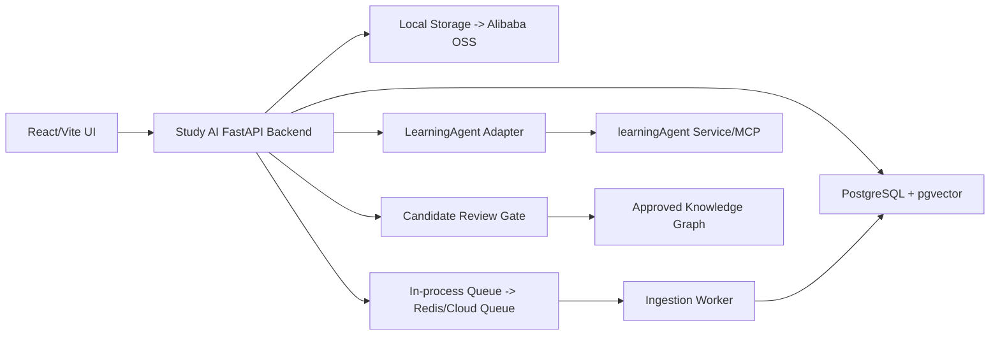

# Study AI Module Task Map

This document is the project execution map. Use it before implementing new work so the project grows by module instead of scattered edits.

## Execution Rule

Every new task should answer four questions before code changes:

1. Which module owns this work?
2. What global capability does it unlock?
3. What artifact or endpoint proves it is done?
4. Which module depends on it next?

## Current Architecture Direction

## Module Overview

| ID | Module | Global Role | Primary Owner Area | Current Status |
| --- | --- | --- | --- | --- |
| M0 | Project Execution Memory | Keeps context, module boundaries, acceptance criteria, and progress recoverable. | docs, `.omx` | Completed |
| M1 | Backend API Contracts | Defines stable API boundaries for UI, workers, database repositories, and LearningAgent. | `backend/app/api`, `backend/tests` | In progress |
| M2 | PostgreSQL Persistence | Turns local demo state into durable deployable state. | `backend/app/adapters`, `backend/migrations` | Pending |
| M3 | Ingestion Worker | Converts uploaded materials into parsed chunks, embeddings, and candidate knowledge. | `backend/app/services`, worker runtime | Pending |
| M4 | Retrieval And RAG | Makes stored knowledge searchable for agents and users. | retrieval service, pgvector, text search | Pending |
| M5 | Memory System | Stores durable personal/project memories with review and audit events. | memory service, memory tables | Pending |
| M6 | LearningAgent Adapter | Reuses `learningAgent` through a service boundary. | adapter, contract tests | Pending |
| M7 | Candidate Review And Graph Writeback | Prevents unreviewed AI output from entering the approved graph. | candidate service, graph repository | Pending |
| M8 | Frontend Workflows | Makes upload, job status, review, retrieval, and graph updates usable. | `src/` | Pending |
| M9 | Deployment And Ops | Supports domain, public access, logs, backups, monitoring, and cloud migration. | Docker, cloud docs, ops scripts | Pending |
| M10 | Scale Practice Lab | Creates personal-project versions of high traffic, failures, and performance incidents. | load tests, reports, metrics | Pending |
| M11 | JVM Companion Learning | Teaches JVM/backend concepts through companion labs tied to real Study AI issues. | separate labs/service docs | Pending |

## M0: Project Execution Memory

### Global Role

M0 prevents context loss. It is the project memory for execution, not the product memory shown to users.

### Work Items

- Maintain this module task map.
- Maintain Ralph PRD and test specification artifacts.
- Maintain a progress ledger that marks which module is active.
- Link README and backend README to the module map.

### Done When

- Future work can start by reading this document plus the progress ledger.
- Each module has a clear next action and verification method.

### Current Evidence

- Module map: `docs/architecture/module-task-map.md`
- Ralph context: `.omx/context/study-ai-module-execution-20260607T065711Z.md`
- PRD: `.omx/plans/prd-study-ai-module-execution.md`
- Test spec: `.omx/plans/test-spec-study-ai-module-execution.md`
- Progress ledger: `.omx/state/study-ai/ralph-progress.json`

## M1: Backend API Contracts

### Global Role

M1 is the HTTP contract layer. Frontend, workers, PostgreSQL repositories, and LearningAgent adapters should all depend on these contracts instead of reaching into each other.

### Work Items

- Keep health endpoints stable.
- Complete upload/document/job endpoints:
  - `POST /v1/uploads`
  - `GET /v1/uploads/{document_id}`
  - `GET /v1/jobs/{job_id}`
- Keep candidate review endpoints out of M1 until M7 begins.
- Keep response serialization stable and tested.

### Done When

- API tests cover success and failure cases.
- The frontend can call these endpoints without knowing storage or database internals.

### Current Evidence

- `POST /v1/uploads` exists.
- `GET /v1/uploads/{document_id}` exists.
- `GET /v1/jobs/{job_id}` exists.
- Backend API route tests cover upload success, empty upload rejection, document lookup, missing document, and job lookup.

## M2: PostgreSQL Persistence

### Global Role

M2 replaces in-memory state with deployable state. Without this, uploaded files and jobs disappear after process restart.

### Work Items

- Add database settings.
- Add PostgreSQL connection lifecycle.
- Implement document repository.
- Implement ingestion job repository.
- Implement chunk, candidate, memory repositories in later passes.
- Run migrations locally.

### Done When

- Upload and job APIs work through PostgreSQL repositories.
- Tests can prove document/job round trips.

## M3: Ingestion Worker

### Global Role

M3 turns uploaded material into useful knowledge. It is the bridge from file upload to RAG and candidate graph updates.

### Work Items

- Load raw file from storage.
- Parse text formats first: `.txt`, `.md`.
- Add PDF later.
- Chunk text with overlap and positions.
- Classify chunks into AI Agent categories.
- Enqueue and update job status by stage.
- Generate candidate knowledge records.

### Done When

- A markdown upload produces chunks and candidates.
- Job status shows processing stages and terminal state.

## M4: Retrieval And RAG

### Global Role

M4 makes the knowledge base queryable by users and agents.

### Work Items

- Implement PostgreSQL full-text retrieval.
- Implement pgvector dense retrieval.
- Add RRF fusion.
- Add retrieval API.
- Add optional reranker later.

### Done When

- Queries return relevant chunks with sources and scores.
- Retrieval tests cover dense/text/fused behavior.

## M5: Memory System

### Global Role

M5 stores durable memories and learning state without letting noisy AI output pollute approved knowledge.

### Work Items

- Add memory creation service.
- Add memory event log.
- Add review status.
- Add memory indexing.
- Borrow guard-level ideas from BestCowork-GA, but persist in PostgreSQL.

### Done When

- Memories can be proposed, judged, approved, rejected, and audited.

## M6: LearningAgent Adapter

### Global Role

M6 lets Study AI reuse the old learning project while staying deployable and modular.

### Work Items

- Keep adapter interface in Study AI.
- Add REST/MCP adapter implementation.
- Add mock contract tests.
- Handle timeout/failure/retry behavior.

### Done When

- Study AI can request learning plan, domain summary, and weak concepts without importing LearningAgent internals.

## M7: Candidate Review And Graph Writeback

### Global Role

M7 is the quality gate. AI can suggest knowledge, but the approved graph changes only after review.

### Work Items

- List candidate knowledge.
- Approve candidate.
- Reject candidate.
- Store evidence records.
- Write approved candidates into graph data model.

### Done When

- Approved candidate becomes graph knowledge.
- Rejected candidate never appears in the approved graph.

## M8: Frontend Workflows

### Global Role

M8 turns backend infrastructure into a real product experience.

### Work Items

- Add upload center.
- Show job status.
- Show candidate review queue.
- Add retrieval/search workflow.
- Keep the 3D graph usable and connected to approved data.

### Done When

- A user can upload material, see processing status, review candidates, and see approved knowledge in the graph.

## M9: Deployment And Ops

### Global Role

M9 makes the project public and maintainable.

### Work Items

- Add local Docker compose.
- Add production deployment docs.
- Add domain and HTTPS plan.
- Add logs, metrics, backups, and restore procedure.
- Plan Alibaba Cloud path: ECS/RDS/OSS/Redis or equivalent.

### Done When

- The app can run from a clean environment with documented steps.
- Public deployment has a rollback and backup plan.

## M10: Scale Practice Lab

### Global Role

M10 gives a personal project realistic high-concurrency practice.

### Work Items

- Generate synthetic documents and chunks.
- Add upload/search/job load scripts.
- Simulate slow SQL, queue backlog, connection pool exhaustion, large uploads, retries, and rate limits.
- Write incident reports with before/after measurements.

### Done When

- You can reproduce at least one bottleneck, fix it, and show measurement improvement.

## M11: JVM Companion Learning

### Global Role

M11 connects backend learning to the project without derailing the main implementation.

### Work Items

- Build small Java/Spring Boot labs tied to active Study AI problems.
- Practice PostgreSQL access, connection pools, transactions, thread pools, caching, and observability.
- Record lessons as candidate knowledge, then review before approval.

### Done When

- Each JVM lesson maps to one real Study AI backend problem and produces a reusable note or candidate knowledge entry.

## Recommended Execution Order

1. M0: lock execution memory.
2. M1: stabilize API contracts.
3. M2: move documents/jobs to PostgreSQL.
4. M3: build ingestion worker.
5. M4: build retrieval.
6. M7: add candidate review.
7. M8: connect frontend workflows.
8. M5/M6: deepen memory and LearningAgent integration.
9. M9: deploy publicly.
10. M10/M11: run scale and JVM learning cycles continuously.
